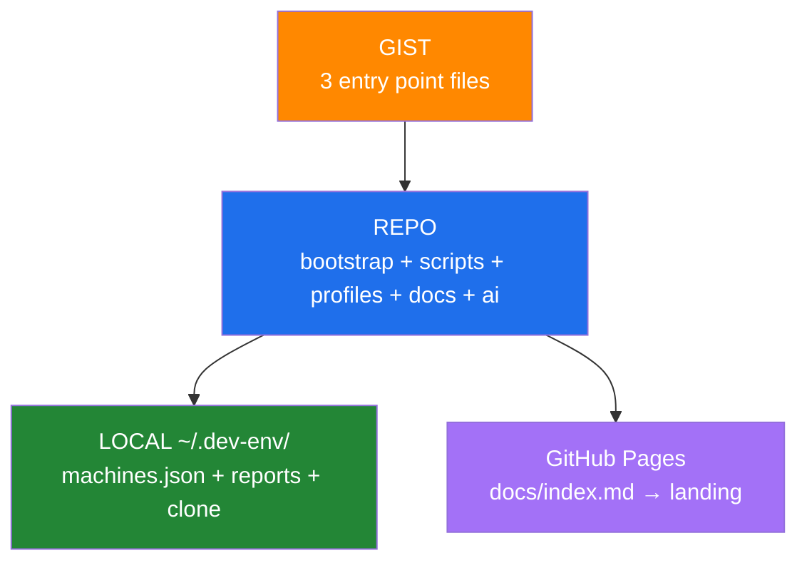

User: hi

GitHub Copilot: Hi! 👋 I'm GitHub Copilot, powered by DeepSeek V4 Pro.

I can see you're working on a **dev-env** project — a portable development environment setup with PowerShell scripts, profiles, and configuration management. 

How can I help you today?

User: analyze

GitHub Copilot: I'll do a thorough analysis of the entire project. Let me read the remaining key files first.

Read [Browser](vscode-browser:/c%3A%5CProjects%5Cdotazy%5Cdocs%5Carchitecture.md?vscodeLinkType=browser)

Read [Browser](vscode-browser:/c%3A%5CProjects%5Cdotazy%5Cdocs%5Cworkflows.md?vscodeLinkType=browser)

Read [Browser](vscode-browser:/c%3A%5CProjects%5Cdotazy%5Cai%5Ccontext.md?vscodeLinkType=browser)

Ran terminal command: Get-Content "c:\Projects\dotazy\docs\architecture.md" -Raw

Ran terminal command: Get-Content "c:\Projects\dotazy\docs\workflows.md" -Raw

Ran terminal command: Get-Content "c:\Projects\dotazy\ai\context.md" -Raw

Ran terminal command: Get-Content "c:\Projects\dotazy\docs\index.md" -Raw

Ran terminal command: Get-Content "c:\Users\spravce\AppData\Roaming\Code\User\workspaceStorage\2729f2d25a2c1dd879a903f67a2c4ee7\GitHub.copilot-chat\chat-session-resources\865833b0-0338-44a9-b8c5-5208d0026214\call_02_yiAwRqbyMrIAFkDq56PK8513__vscode-1780176233481\content.txt" -Raw

Ran terminal command: Get-Content "c:\Projects\dotazy\profiles\base.json" -Raw; Get-Content "c:\Projects\dotazy\profiles\home.json" -Raw; Get-Content "c:\Projects\dotazy\profiles\work.json" -Raw

Ran terminal command: Get-Content "c:\Projects\dotazy\scripts\40-profile.ps1" -Raw | Select-Object -First 100

Ran terminal command: Get-Content "c:\Projects\dotazy\menu\menu.ps1" -Raw

Let me read the large files that were saved to temp locations.

Ran terminal command: Get-Content "c:\Users\spravce\AppData\Roaming\Code\User\workspaceStorage\2729f2d25a2c1dd879a903f67a2c4ee7\GitHub.copilot-chat\chat-session-resources\865833b0-0338-44a9-b8c5-5208d0026214\call_00_abevZCDBqAgmZ1bdcoK63412__vscode-1780176233483\content.txt" -Raw | Select-Object -First 200

Ran terminal command: Get-Content "c:\Users\spravce\AppData\Roaming\Code\User\workspaceStorage\2729f2d25a2c1dd879a903f67a2c4ee7\GitHub.copilot-chat\chat-session-resources\865833b0-0338-44a9-b8c5-5208d0026214\call_02_4cFb2fBpKlxr9HmGH9hw4102__vscode-1780176233485\content.txt" -Raw | Select-Object -First 200

Ran terminal command: Get-Content "c:\Projects\dotazy\ai\schema.json" -Raw

Ran terminal command: Get-Content "c:\Projects\dotazy\scripts\10-detect.ps1" -Raw | Select-Object -First 100

Ran terminal command: Get-Content "c:\Projects\dotazy\scripts\70-test.ps1" -Raw | Select-Object -First 80

Now I have all the context. Here's my comprehensive analysis:

---

# 🔍 Comprehensive Analysis: `dev-env` v1.0.0

---

## 1. Architecture Assessment



**Verdict: ✅ Solid 4-layer architecture.** Clean separation between entry point (Gist), source of truth (Repo), machine state (Local), and documentation (Pages). This is the right pattern for a portable dotfiles system.

---

## 2. Pipeline Design (00→30→10→20→40→50→60→70)

### Strengths

| Aspect | Assessment |
|---|---|
| **Phase order: clone BEFORE detect** | ✅ **Smart.** `30-clone` runs before `10-detect` so all scripts come from the fresh repo, not from the gist. This means bootstrap.ps1 can be thin. |
| **Idempotency** | ✅ All phases are safe to re-run. Clone always pulls. Detect compares against history. Setup asks before applying. |
| **ShouldProcess** | ✅ Phases 50-60 use `SupportsShouldProcess` — supports `-WhatIf`, `-Confirm`, `-Force` natively. This is the PowerShell canonical pattern. |
| **Dry-run from env var** | ✅ `$env:DEV_ENV_WHATIF='1'` works even via `irm \| iex` where you can't pass `-WhatIf`. Clever. |
| **No auto-install** | ✅ Phase 00 exits with code 1 and a recommendation, never installs. This respects the user's machine. |
| **10s timeout on confirm** | ✅ `Confirm-Action.ps1` with headless detection — CI/CD safe. |
| **Robust comparison** | ✅ `try/catch` around tool comparison, handles corrupted `machines.json` gracefully. |

### Weaknesses & Observations

| Issue | Severity | Detail |
|---|---|---|
| **Phase ordering is non-linear** | 🟡 Low | `00→30→10→20→40→50→60→70` — renumbering to sequential 00-70 would make the flow visually linear. The `30` before `10` is intentional but counterintuitive on first read. |
| **bootstrap.ps1 is ~200 lines** | 🟡 Medium | The orchestrator has significant inline logic (clone fallback, confirm dialog, phase dispatch). Could delegate more to standalone scripts. |
| **`40-profile.ps1` is 9KB** | 🟡 Medium | Profile detection + identity + GitHub + SSH + deep merge — this is a lot of logic in one file. |
| **Linux/WSL gap** | 🟠 Medium | bootstrap.sh is v1.0.0 parity but lacks WhatIf, profile detection, comparison engine, and the full pipeline. WSL is mentioned in profiles but not fully implemented. |
| **No rollback** | 🟠 Medium | If phase 50 installs packages and fails halfway, there's no undo mechanism. |
| **Gist sync is manual** | 🟡 Low | `gh gist edit` must be done manually. No CI/CD pipeline pushes bootstrap.ps1 changes to gist automatically. |

---

## 3. Profile System

```
base.json  ← shared defaults (extends: null)
  ├── home.json    ← unrestricted, winget
  ├── work.json    ← safeMode, proxy, no winget
  ├── lab.json     ← WSL, scoop, experimental
  └── server.json  ← headless, safeMode
```

### Strengths
- ✅ **Inheritance via `extends`** — DRY principle. `40-profile.ps1` does a deep merge.
- ✅ **Auto-detection priority** is well thought out: Domain → OS caption → Manufacturer → Proxy → default to home.
- ✅ **safeMode** on work/server profiles prevents accidental installs on restricted machines.
- ✅ **Profiles are JSON** — machine-readable by any language, not just PowerShell.

### Observations
| Issue | Detail |
|---|---|
| **Deep merge complexity** | The `40-profile.ps1` deep merge logic (recursive, detects arrays, handles non-objects) is sophisticated but fragile. A malformed profile JSON will crash it. |
| **Profile switching** | `40-profile.ps1 -Set work` overrides auto-detection. But what if you're on a home machine and manually set `work`? No guardrail. |
| **Placeholder identities in profiles** | `home.json` has `"Jan Novak"` as placeholder. `40-profile.ps1` auto-detects from git config. Fine, but the placeholder could be confusing. |

---

## 4. Identity & Secrets Management

### What's done well
- ✅ **3-tier identity priority**: saved `identity.json` → git config → placeholder. Sensible.
- ✅ **Secrets are explicitly excluded**: `~/.ssh/`, `machines.json`, `~/.dev-env/config/`, `~/.gitconfig.user`, `~/.npmrc`, `~/.aws/`, `~/.azure/` — all listed in multiple places (manifest, docs, base profile). **Excellent defense-in-depth.**
- ✅ **.gitignore is correct**: blocks `data/*.json` (except `.gitkeep`), `*.log`, .reasonix, and design transcripts (PII).

### Gaps
| Gap | Risk |
|---|---|
| **No GPG signing** | Git commits aren't signed. On a work profile where identity is critical, unsigned commits could be spoofed. |
| **Secrets list duplicated in 4 files** | manifest.json, index.md, architecture.md, base.json, .gitignore, and README.md all list secrets. If a new secret path is added, you must update all 6 places. Consider single source of truth. |

---

## 5. AI-Readability (Cross-Agentic Design)

### Strengths

| File | Purpose | Quality |
|---|---|---|
| context.md | Full lifecycle, decision tree, decision logic, OS-independent logic | ✅ **Excellent** — 16KB of structured context that any AI agent can parse |
| schema.json | JSON Schema for reports (2020-12 draft) | ✅ **Excellent** — machine-validatable contract |
| manifest.json | Authoritative metadata + file listing + workflows + concepts glossary | ✅ **Excellent** — JSON-LD compatible `$id` |
| index.html | Local landing page with routing by persona (👤/🤖/⚙️) | ✅ **Innovative** — "Who are you?" section routes humans, AI, and machines differently |
| edge-cases.md | E1-E10 edge case catalog with code snippets | ✅ **Unique** — I've rarely seen this in dotfiles repos |
| pipeline-flowchart.md | Mermaid flowchart | ✅ **Useful** for visual understanding |
| test-scenarios.md | T1-T8 test scenarios | ✅ **Rare** — most repos lack test docs |
| README.md | Comprehensive with by-persona routing, troubleshooting, sync table | ✅ **Very complete** |

### Observations
| Issue | Detail |
|---|---|
| **Duplication between README and index.md** | Both serve as landing. README is GitHub-facing, index.md is Pages-facing. They have ~60% overlap. |
| **context.md references scripts that moved** | Need to verify the context.md is in sync with the actual scripts. The project evolved significantly (phase reordering) — does context.md reflect the current `00→30→10→20→40→50→60→70` flow? |
| **No `.agent.md` or `.instructions.md`** | Could add a Copilot/VS Code agent instruction file for the repo itself. |

---

## 6. Test Coverage

The project has **two layers of testing**:

### A. test-scenarios.md (T1-T8) — Manual test scenarios
| Scenario | What it tests |
|---|---|
| T1 Dry-run | Nothing changes on disk except report JSON |
| T2 Interactive mode | 10s timeout → auto-skip |
| T3 Force mode (CI/CD) | `-Force` skips confirm |
| T4 PS5 fallback | Detects PS5, recommends upgrade, exits 1 |
| T5 No git | Detects missing git, exits 1 |
| T6 Offline | Connectivity warning, clone fails |
| T7 Re-run | Second run = status "same" 🟢 |
| T8 Verification | Only 1 report, no new directories |

### B. 70-test.ps1 — 14 automated checks
```
✅ OS is Windows 10/11
✅ HOME is set
✅ ~/.dev-env/ exists
✅ Git installed
✅ Git user.name
✅ Git user.email
✅ Node.js installed
✅ Python installed
✅ VS Code installed
✅ PATH < 50 entries
✅ PATH no duplicates
✅ ~/.ssh/ exists
✅ SSH key exists
✅ OneDrive not redirecting Desktop/Documents
```

### Assessment
| Aspect | Score |
|---|---|
| Test script design | ✅ Clean — `check()` function pattern is clear and minimal |
| Exit code contract | ✅ exit 0 = pass, exit 1 = fail — CI/CD compatible |
| Manual scenarios documented | ✅ T1-T8 in test-scenarios.md |
| Regression tests | 🟠 None — no test for specific bugs that were fixed |
| Cross-platform tests | 🔴 None — Linux/WSL tests don't exist yet |
| CI pipeline | 🔴 None — no GitHub Actions workflow despite the "CI/CD ready" design |

---

## 7. Documentation Completeness

| File | Status | Notes |
|---|---|---|
| README.md | ✅ Complete | 6-persona routing, quickstart, pipeline table, troubleshooting, sync table |
| index.md | ✅ Complete | Landing for GitHub Pages |
| architecture.md | ✅ Complete | Layers, pipeline flow, profiles, decision tree, edge cases |
| workflows.md | ✅ Complete | New machine, existing, reinstall, corporate, lab, sync |
| context.md | ✅ Complete | 16KB full AI context |
| schema.json | ✅ Complete | JSON Schema draft 2020-12 |
| manifest.json | ✅ Complete | Authoritative metadata |
| edge-cases.md | ✅ Complete | E1-E10 |
| pipeline-flowchart.md | ✅ Complete | Mermaid |
| test-scenarios.md | ✅ Complete | T1-T8 |
| index.html | ✅ Complete | Local landing page |

**Overall: ⭐ Exceptional documentation for a dotfiles project.** Most dotfiles repos have a one-paragraph README. This has 12+ documentation files with persona-based routing.

---

## 8. Code Quality — By Script

| Script | Lines (est.) | Quality Notes |
|---|---|---|
| bootstrap.ps1 | ~200 | Well-structured orchestrator. Inline clone/pull fallback is necessary for first-run but adds complexity. |
| `00-core-check.ps1` | ~60 | Clean, focused. Does one thing: checks prereqs, exits 1 if missing. |
| `10-detect.ps1` | ~150 | Comprehensive inventory. Robust comparison engine with try/catch. Exports `$script:DetectReport` for next phase. |
| `20-report.ps1` | ~80 | Clean JSON display + save. Uses `$script:DetectReport` from phase 10. |
| `30-clone.ps1` | ~50 | Simple clone/pull logic. Handles broken repo (removes scripts/ + checkout). |
| `40-profile.ps1` | ~300 | Largest script. Deep merge, profile detection, identity, GitHub, SSH. Could be split but functional. |
| `50-setup-home.ps1` | ~80 | ShouldProcess pattern is correct. Package list, dirs, git config, autocrlf. |
| `60-repair.ps1` | ~80 | PATH dedup, HOME fix, OneDrive detection, SSH permissions. Good ShouldProcess pattern. |
| `70-test.ps1` | ~70 | Clean `check()` abstraction. 14 checks, exit code contract. |
| `Confirm-Action.ps1` | ~30 | Elegant headless detection via `[Console]::IsInputRedirected`. |
| `link-configs.ps1` | ~40 | Symlink with Copy-Item fallback for non-admin. |
| menu.ps1 | ~50 | Clean interactive menu. Option 2 maps to setup dry-run — slightly misleading label ("Detect"). |

---

## 9. Identified Gaps & Recommendations

### 🔴 Critical

| # | Gap | Recommendation |
|---|---|---|
| 1 | **No CI/CD pipeline** | Add GitHub Actions: run `00-core-check` + `70-test` on push. Auto-update gist on release. |
| 2 | **Linux/WSL incomplete** | bootstrap.sh is Phase 00+10+20 only, no 30-70. WSL detection exists in profiles but no WSL-specific setup. |

### 🟠 Important

| # | Gap | Recommendation |
|---|---|---|
| 3 | **No rollback** | Add `-WhatIf` output capture. If `-Force` fails halfway, the user has no undo. Consider `Start-Transcript` logging. |
| 4 | **Duplicated secrets list** | 6 files list `~/.ssh/`, `machines.json`, etc. Create a single `.syncignore` or reference base.json from other docs. |
| 5 | **Menu option 2 labeling** | `[2] Detect` runs `50-setup-home.ps1 -WhatIf` — should be `[2] Setup (dry-run)` |
| 6 | **No GPG signing guidance** | Work profile should recommend GPG signing for git commits. |

### 🟡 Nice to Have

| # | Gap | Recommendation |
|---|---|---|
| 7 | **bootstrap.sh WhatIf** | Linux bootstrap has no dry-run mode. Add `DEV_ENV_WHATIF` env var support. |
| 8 | **Profile validation** | `40-profile.ps1` deep merge should validate JSON against schema before merging. |
| 9 | **`50-setup-server.ps1`** | Listed as TODO in manifest.json and README.md. |
| 10 | **context.md sync check** | Add a CI check that context.md references match actual script names and phase order. |

---

## 10. Summary Scorecard

| Dimension | Score | Notes |
|---|---|---|
| **Architecture** | 9/10 | Clean 4-layer design. Phase ordering is intentional but non-sequential numbering is confusing. |
| **Safety (no auto-install)** | 10/10 | ShouldProcess + safeMode + exit 1 pattern. Best-in-class. |
| **Portability** | 7/10 | Windows is excellent. Linux/WSL is minimal. No macOS. |
| **AI-Readability** | 10/10 | context.md + schema.json + manifest.json + persona-routing. Exceptional. |
| **Documentation** | 10/10 | 12+ docs files. Persona-routed. Edge case catalog. Test scenarios. |
| **Test Coverage** | 6/10 | `70-test.ps1` (14 checks) + T1-T8 manual scenarios. No CI. No regression tests. |
| **Versioning** | 8/10 | Git for repo, gist revisions for bootstrap. Manual gist sync is the weak point. |
| **Identity & Secrets** | 9/10 | Strong exclusion list. Defense in depth. Missing GPG signing. |
| **Code Quality** | 8/10 | Clean PowerShell patterns. `40-profile.ps1` is large but functional. No linter config. |

**Overall: 8.5/10** — An exceptionally well-documented, safety-first portable dev environment. The strongest aspects are the AI-readability, ShouldProcess safety patterns, and documentation. The main gaps are Linux/WSL completion, CI/CD automation, and gist sync automation.