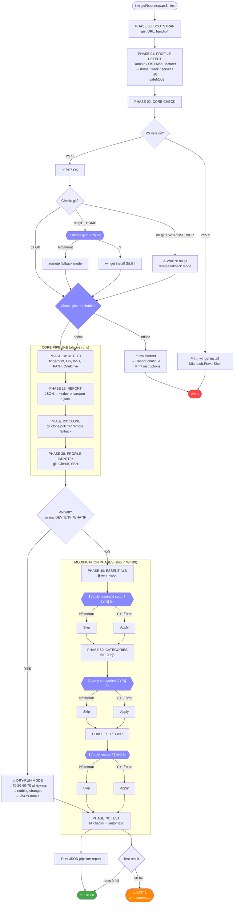

```mermaid
flowchart TD
    START(["irm gist/bootstrap.ps1 | iex"]) --> PH00[PHASE 00: BOOTSTRAP<br/>gist URL, hand-off]
    PH00 --> PH01[PHASE 01: PROFILE DETECT<br/>Domain / OS / Manufacturer<br/>→ home / work / server / lab<br/>→ safeMode]
    
    PH01 --> PH02[PHASE 02: CORE CHECK]
    PH02 --> PS7{PS version?}
    PS7 -->|PS5.x| PS5_ACTION[Print: winget install Microsoft.PowerShell]
    PS5_ACTION --> EXIT1([exit 1])
    PS7 -->|PS7+| PS7OK[✅ PS7 OK]
    PS7OK --> GITCHECK{Check: git?}
    
    GITCHECK -->|no git + WORK/SERVER| GITCORP[⚠ WARN: no git<br/>remote fallback mode]
    GITCORP --> NETCHECK
    GITCHECK -->|no git + HOME| GITHOME{{"❓ Install git? [Y/N] 5s"}}
    GITHOME -->|Y| GITINSTALL[winget install Git.Git]
    GITINSTALL --> NETCHECK
    GITHOME -->|N/timeout| GITSKIP[remote fallback mode]
    GITSKIP --> NETCHECK
    GITCHECK -->|git OK| NETCHECK
    
    NETCHECK{Check: gist reachable?}
    NETCHECK -->|offline| OFFLINE[⚠ No internet<br/>→ Cannot continue<br/>→ Print instructions]
    OFFLINE --> EXIT1
    NETCHECK -->|online| PH10
    
    subgraph "CORE PIPELINE (always runs)"
        PH10[PHASE 10: DETECT<br/>fingerprint, OS, tools, PATH, OneDrive]
        PH15[PHASE 15: REPORT<br/>JSON → ~/.dev-env/report-*.json]
        PH20[PHASE 20: CLONE<br/>git clone/pull OR remote fallback]
        PH30[PHASE 30: PROFILE IDENTITY<br/>git, GitHub, SSH]
    end
    
    NETCHECK --> PH10
    PH10 --> PH15
    PH15 --> PH20
    PH20 --> PH30
    
    PH30 --> WHATIF_CHECK{"-WhatIf?<br/>or env:DEV_ENV_WHATIF"}
    
    WHATIF_CHECK -->|YES| DRYRUN_ONLY[⚠ DRY-RUN MODE<br/>→ 40-50-60-70 all dry-run<br/>→ nothing changes<br/>→ JSON output]
    
    WHATIF_CHECK -->|NO| PH40[PHASE 40: ESSENTIALS<br/>🖥️ wt + pwsh]
    
    subgraph "MODIFICATION PHASES (skip in WhatIf)"
        PH40 --> PH40_CONFIRM{{"❓ Apply essential setup? [Y/N] 5s"}}
        PH40_CONFIRM -->|Y + -Force| PH40_APPLY[Apply]
        PH40_CONFIRM -->|N/timeout| PH40_SKIP[Skip]
        PH40_APPLY --> PH50
        PH40_SKIP --> PH50
        
        PH50[PHASE 50: CATEGORIES<br/>🌐🤖📝🔧📦]
        PH50 --> PH50_CONFIRM{{"❓ Apply categories? [Y/N] 5s"}}
        PH50_CONFIRM -->|Y + -Force| PH50_APPLY[Apply]
        PH50_CONFIRM -->|N/timeout| PH50_SKIP[Skip]
        PH50_APPLY --> PH60
        PH50_SKIP --> PH60
        
        PH60[PHASE 60: REPAIR]
        PH60 --> PH60_CONFIRM{{"❓ Apply repairs? [Y/N] 5s"}}
        PH60_CONFIRM -->|Y + -Force| PH60_APPLY[Apply]
        PH60_CONFIRM -->|N/timeout| PH60_SKIP[Skip]
        PH60_APPLY --> PH70
        PH60_SKIP --> PH70
    end
    
    PH70[PHASE 70: TEST<br/>14 checks → automatic]
    DRYRUN_ONLY --> PH70
    
    PH70 --> PH70_RESULT{Test result}
    PH70_RESULT -->|pass 0 fail| PASS([✅ EXIT 0])
    PH70_RESULT -->|>0 fail| FAIL([⚠ EXIT 1<br/>print summary])
    PH70 --> JSON_END[Print JSON pipeline report]
    JSON_END --> PASS
    
    style EXIT1 fill:#ff4444,color:white
    style PASS fill:#44aa44,color:white
    style FAIL fill:#ff8800,color:white
    style NETCHECK fill:#8888ff,color:white
    style GITHOME fill:#8888ff,color:white
    style PH40_CONFIRM fill:#8888ff,color:white
    style PH50_CONFIRM fill:#8888ff,color:white
    style PH60_CONFIRM fill:#8888ff,color:white
```
